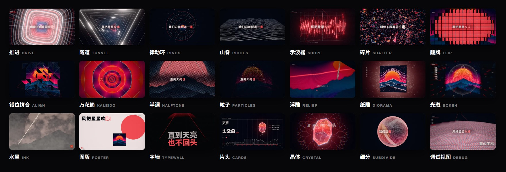
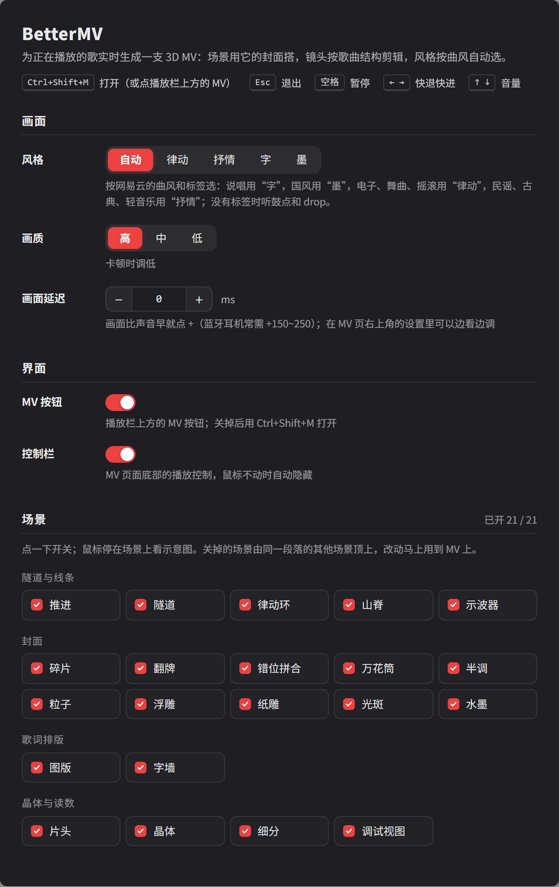

<div align="center">


# BetterMV

**网易云里的每首歌，都能有一支自己的 MV。**

放一首歌，点播放栏上方的 MV（或按 Ctrl+Shift+M）。BetterMV 先把整首歌听一遍，<br>
再用这首歌的封面搭出一个 3D 世界，跟着节拍剪成一支 MV，全部在你的电脑上实时生成。

**还在开发中**：现在是预发布的开发版，还有不少已知问题，欢迎试用和反馈。

[开发版下载](https://github.com/xiaoming6680/NCM-BetterMV/releases) · [更新记录](CHANGELOG.md) · [问题反馈](https://github.com/xiaoming6680/NCM-BetterMV/issues)

</div>

## 它会做什么

- **先听懂这首歌**：速度、拍子，前奏、主歌、副歌、drop 各在哪。镜头按段落换，动作落在重拍上；drop 一来，冲进隧道。
- **世界用封面搭**：封面的颜色、明暗和构图就是场景。每首歌长得都不一样，黑白封面就是一支黑白 MV。
- **风格跟着歌走**：快歌、电子是“律动”，慢歌是“抒情”，说唱是“字”，国风是“墨”。按网易云的曲风标签和音频自动选，也可以手动换。
- **歌词跟着唱**：一个词一个词出现，有逐字歌词的歌按逐字时间走，有翻译的附上翻译。
- **每首歌一颗晶体**：形状由这首歌的速度、鼓点和人声决定，开场、drop 前和歌的结尾都会出现。

<p align="center"></p>

<p align="center">21 个场景：隧道、推进、碎片、万花筒、粒子、半调、水墨、字墙、调试视图……</p>

> 图中的封面和歌词是示意，插件里用的是正在播放的歌自己的封面和歌词。

## 设置

<p align="center"></p>

- **风格**：自动，或固定成律动、抒情、字、墨。
- **画质**：卡顿时调到中或低。
- **画面延迟**：戴蓝牙耳机时画面会比声音早，调成 +150～250 ms。MV 页右上角的齿轮里也能边看边调。
- **MV 按钮、控制栏**：不想要播放栏上方的按钮可以关掉，改用 Ctrl+Shift+M。
- **场景**：不喜欢的场景点一下关掉，鼠标停在场景上会显示示意图。

MV 页里：空格暂停，← → 快退快进，↑ ↓ 调音量，Esc 退出。

## 安装开发版

BetterMV 是一个 BetterNCM 插件，还没开发完，暂时不上架 BetterNCM 插件商店。想先用的话，下载预发布的开发版：

1. **安装 BetterNCM**：下载并运行 [BetterNCM 安装器](https://github.com/std-microblock/BetterNCM-Installer/releases)，点“安装”。BetterNCM 是网易云音乐 PC 版的开源插件管理器，已经装过的跳过这一步。
2. **放入 BetterMV**：从 [Releases](https://github.com/xiaoming6680/NCM-BetterMV/releases) 下载标着 Pre-release 的开发版 `.plugin` 文件，放进 BetterNCM 的插件文件夹（默认 `C:\betterncm\plugins`）。
3. **重启网易云**：放一首歌，点播放栏上方的 **MV**，或按 **Ctrl+Shift+M**。

需要 Windows、网易云音乐 3.x、BetterNCM 1.3.4 或更新版本，显卡支持 WebGL 2。目前只在网易云 3.1.37 + BetterNCM 1.3.4 上测过。

## 已知问题

- **第一次打开一首歌要等几秒**：要先读取、分析整首歌。分析在主线程分片进行（网易云的内核不允许插件开后台线程）。同一首歌再打开就是立刻。
- **段落不是每首都分得准**：在 12 首标注过的歌上，段落名称按时长算 99% 对得上，但没标注过的歌可能把铺垫认成副歌，或者边界差一两小节，镜头就会切在不该切的地方。
- **风格靠网易云的曲风标签**：没有标签的歌只能听鼓点和有没有 drop 来猜，说唱、国风这类没标签时认不出来，可以在设置里手动换。
- **歌词时间是估的**：网易云没有逐字歌词的歌，每个词的时间按音节估算，会和实际唱的有出入。
- **人声切片的“卡顿重复”很少出现**：现在只按歌词触发，网易云的歌词很少写出切片。
- **测试范围小**：只在一台 RTX 5070 Ti 笔记本上测过，核显和别的网易云版本还没测；卡的话把画质调到中或低。

## 接下来的方向

- 分析给出可信度，拿不准的地方少做卡点运镜，不乱切。
- 从音频里认出人声切片，不只靠歌词。
- 更多场景，比如雕版排线、无限嵌套的画中画。
- 在更多电脑、更多网易云版本上实测。

**欢迎反馈**：哪首歌分得不对、风格选错了、哪里卡、哪个场景不好看，都欢迎在 [Issues](https://github.com/xiaoming6680/NCM-BetterMV/issues) 里告诉我，附上歌名最有用。

## 常见问题

**点开后要等几秒？**
第一次打开一首歌时，BetterMV 要读取并分析整首歌，一般几秒钟；之后同一首歌再打开就是立刻。

**需要联网吗？会上传什么？**
音频用网易云本地缓存的那份，没缓存完就按普通音质向网易云取。歌词、封面和曲风标签也是向网易云取的。所有画面在本机生成，不上传任何东西。

**卡顿、风扇响？**
在设置里把画质调到中或低。MV 用显卡实时渲染，核显的电脑建议用“低”。

**画面和声音对不上？**
在设置里调“画面延迟”：画面比声音早就往 + 调。

**这首歌的风格选得不对？**
设置里手动换风格，也欢迎告诉我是哪首歌。

**装了 BetterNCM 后网易云打不开？**
重新运行 BetterNCM 安装器，点“卸载”，网易云就能恢复。

## 开发者

需要 [Bun](https://bun.sh)。开发说明、风格手册和验证记录都在 [docs/](docs/)。

```sh
bun install
bun run dev      # 浏览器里预览：http://localhost:5190/?id=歌曲ID（歌要在网易云里完整播放过一遍）
bun run plugin   # 装进 BetterNCM 的开发插件目录，重启网易云生效
bun run pack     # 打包成 dist/ncm-better-mv.plugin
```

插件预览图和 README 配图的源文件在 `film/`（`bun film/render.ts --images`）。

## 开源协议

GPL-3.0-or-later。内置字体 Archivo 使用 SIL Open Font License 1.1（`public/fonts/OFL.txt`），打包进插件的 three.js 使用 MIT 协议。

作者 [XIAOMING6680](https://github.com/xiaoming6680)。插件标识为 `ncm-better-mv`。
